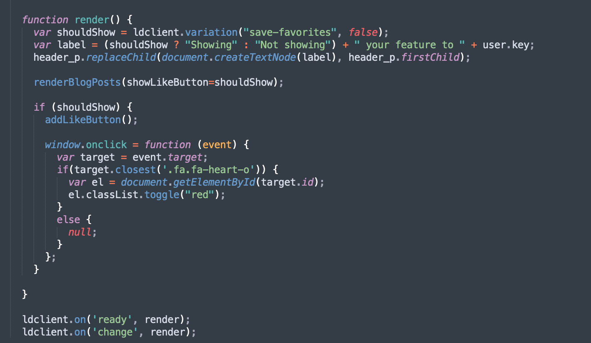

## Feature Flag Demo

This project demonstrates how to leverage LaunchDarkly's Javascript SDK to create a simple feature-flag.

When enabled, the ability to favorite a post is visible. When disabled, the feature is no longer available or visible to the user. 

#### Enabled

#### Disabled

### How to see it in action?

Go to your browser of choice and open the index.html file.

### How does it work?

The code starts by building out the user for LaunchDarkly, and initializing the SDK:

At the core, there is a render function that renders content to the page:

The LaunchDarkly SDK returns a boolean value for the feature-flag which allows me to include logic to add the like button or exclude it.

